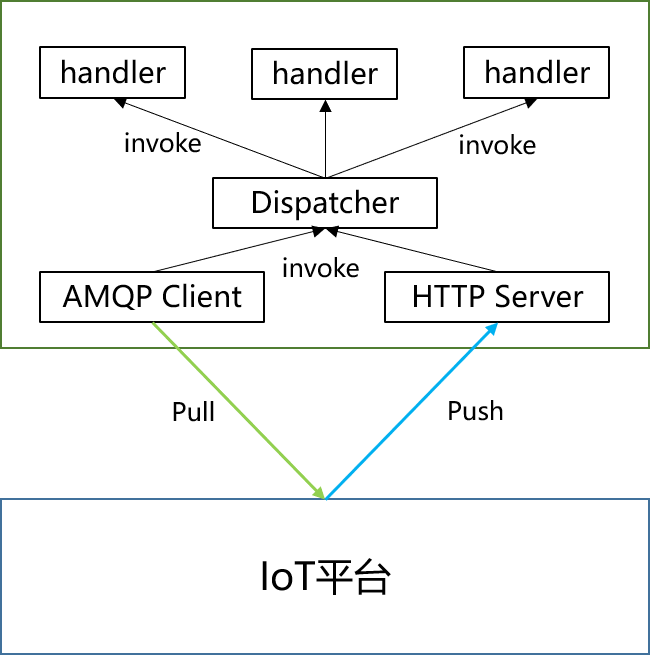

# huaweicloud-iot-push-sdk-java

huaweicloud-iot-push-sdk-java提供接收华为云IoT平台数据推送Java版本SDK，同时支持AMQP协议和HTTP(S)协议，使用该SDK开发的应用只需要编写一次业务逻辑处理，SDK自动屏蔽不同协议的差异，将来华为云IoT支持更多推送协议时，应用如果想切换使用新的推送协议，应用的业务逻辑处理不需要做任何改动。

### 整体架构

SDK本身可以看作一个IoT平台推送消息的代理，SDK负责从IoT平台接收推送数据或从平台拉去数据，然后将数据统一发送给内部的Dispatcher，dispatcher将接收到的消息按照类比分发给应用自定义的handler进行处理。

### 安装构建

使用Git命令clone工程到本地

~~~
git clone git@github.com:ctlove0523/huaweicloud-iot-amqp-sdk-java.git
~~~

使用maven将jar安装到本地

~~~
mvn clean install
~~~

### 样例

#### 添加依赖（以maven为例）

~~~
<dependency>
	<groupId>io.github.ctlove0523</groupId>
	<artifactId>huawei-iot-push-sdk-java</artifactId>
	<version>{version}</version>
</dependency>
~~~

#### 编写通用的业务逻辑处理。

SDK基于回调机制实现，应用需要实现特定的interface，并将实现添加到dispatcher中。下面以接收设备删除推送消息为例，假设应用在收到IoT平台推送的设备删除消息时需要执行以下业务逻辑：1、记录一条日志；2、发送设备删除消息到消息代理（kafka、ActiveMQ等）；3、删除数据库数据。那么业务处理类只需要实现`IotDeviceDeletedHandler`，伪代码如下：

~~~java
public class TestIotDeviceDeletedHandler implements IotDeviceDeletedHandler {
	@Override
	public void handle(IotDeviceDeleteData data) {
        // 记录日志
		log.info("begin to handle device delte");
        
        // 发送设备删除消息到消息代理
        messageProxy.write(data);
        
        // 删除数据库数据
        deleteDataFromDatabase(data.getNotifyData().getHeader().getDeviceId())
	}
}
~~~

#### 注册TestIotDeviceDeletedHandler

~~~java
IotMessageDispatcher dispatcher = new DefaultIotMessageDispatcher();
dispatcher.addIotDeviceDeletedHandler(new TestIotDeviceDeletedHandler())
~~~

#### 使用AMQP协议接收设备删除推送数据

~~~java
IotAmqpClientOptions options = new IotAmqpClientOptions();
options.setHost("015f603f73.iot-amqps.cn-north-4.myhuaweicloud.com")  // 使用自己独立的接入域名
		.setPort(5671)
		.setAccessCode("access code")
		.setAccessKey("access key")
		.setQueueNames(Collections.singletonList("test"))
		.setSsl(true)
		.setDispatcher(dispatcher);

IotAmqpClient iotAmqpClient = IotAmqpClient.create(options);
iotAmqpClient.connect().block();
~~~

#### 使用HTTP协议接收设备删除推送数据

~~~true
IotHttpServerOptions options = new IotHttpServerOptions();
options.setDispatcher(dispatcher)
		.setHost("yourhost.com") // 部署应用的地址或者域名，必须可以公网访问
		.setPort(5230)
		.setUrl("/push-data");   // 在IoT配置的推送URL
IotHttpServer server = IotHttpServer.createIotHttpServer(options);
server.start().block();
~~~

从上面的示例来看，不管是使用AMQP协议还是HTTP协议接收IoT平台设备删除推送数据，应用的业务处理逻辑不需要任何修改，这样在应用更换推送协议或者方式时可以保持业务逻辑的稳定。